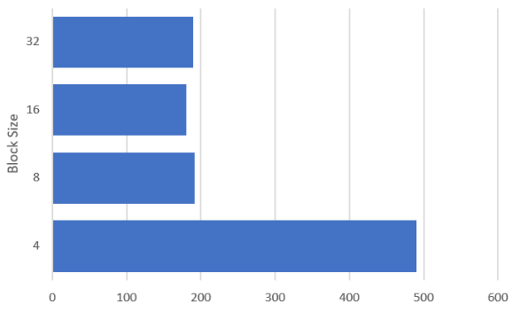

# Reduced Matrix Multiplication Report

    1. Srinjoy Mukherjee(SrNo: 21152)
    2. Adesh Adikane(SrNo: 21027) 

 

The link for the github repository: [Reduced Matrix Multiplication](https://github.com/Acejoy/Reduced-Matrix-Multiplication)

## Part A

In this part of the assignment, we are supposed to implement single threaded and multi-threaded Reduced Matrix Multiplication(RMM) . Naive implementation is given for reference.Improving the performance of the operation can be achieved using many ways. In the previous assignment , we explored improvement by using blocked matrix multiplication and loop interchange.We observed significanr improvement using those techniques. In this assigment we use vector instructions to exploit data parallelism. We make a avx vector if 256 bits/4 integers and do the addition and multiplication operations with the corresponding vectors of the other matrix.We also use loop interchange to utilise locality of reference.We observe significant improvement over naive implementation of RMM.The reason for the improvement is using data parallelism, SIMD instructions, where a single instruction is fetched and decoded but executed on multiple elements.In multi-threaded implementation we use 8 threads . Each thread is responsible for calculating RMM for (N/8) number of rows of resultant matrix where N is the size of resultant matrix.

The code was run on CLServ.

 
 

<h2>Charts</h2>
The charts for different implementations for each matrix size:

1. Time(in ms): 
2. L1 Read Cahce Misses(in logarithm scale): 
3. LL Read Cache Misses(in logarithm scale): 
4. LL Write Cache Misses(in logarithm scale): 
5. TLB Misses(in logarithm scale): 
6. Page Faults(in logarithm scale): 

 
 

### Observations

We make the graphs of the different counters we used to compare the performance. We compare the performance on the following parameters:

1. Time
2. L1 Read Miss
3. LL Read Miss
4. LL Write Miss
5. TLB Miss
6. Page Faults

<h2>Observation Table</h2>

| IMPLEMENTATION  | SIZE  | TIME     | L1 READ MISS | LL READ MISS | LL WRITE MISS | TLB MISS    | PAGE FAULT |
| --------------- | ----- | -------- | ------------ | ------------ | ------------- | ----------- | ---------- |
| REFERENCE       | 16    | 0.107    | 37           | 0            | 0             | 1           | 0          |
| SINGLE-THREADED | 16    | 0.08     | 43           | 0            | 0             | 0           | 0          |
| MULTI-THREADED  | 16    | 0.831    | 1460         | 64           | 10            | 179         | 16         |
| REFERENCE       | 4096  | 986309   | 30981154829  | 18278461380  | 311788        | 17350628081 | 0          |
| SINGLE-THREADED | 4096  | 258387   | 11289280138  | 5115642215   | 179371        | 6813772779  | 40917      |
| MULTI-THREADED  | 4096  | 42577.9  | 1830         | 392          | 91            | 373         | 30         |
| REFERENCE       | 8192  | 8539590  | 2.96909E+11  | 1.33618E+11  | 1529653       | 1.39737E+11 | 0          |
| SINGLE-THREADED | 8192  | 2549420  | 1.1181E+11   | 52095504886  | 3581961       | 55496798295 | 32768      |
| MULTI-THREADED  | 8192  | 421384   | 1667         | 429          | 79            | 420         | 38         |
| REFERENCE       | 16384 | 69689700 | 3.06613E+12  | 1.85347E+12  | 8174646       | 1.12464E+12 | 8337199    |
| SINGLE-THREADED | 16384 | 23426700 | 9.64299E+11  | 5.60175E+11  | 16979372      | 4.64353E+11 | 419786     |
| MULTI-THREADED  | 16384 | 3457470  | 1805         | 594          | 108           | 495         | 42         |

 
 
Looking at the tale, we observe that the numbers are too high, so for ease of plotting them on the graph , we simply take the performance improvement ratio. For each parameter it is calculated by: (Reference Value/Improved Value).

 

<h2>Improvement Ratio Table</h2>

| IMPLEMENTATION  | SIZE  | TIME   |
|-----------------|-------|--------|
| REFERENCE       | 16    | 1      |
| SINGLE-THREADED | 16    | 1.3375 |
| MULTI-THREADED  | 16    | 0.128  |
| REFERENCE       | 4096  | 1      |
| SINGLE-THREADED | 4096  | 3.817  |
| MULTI-THREADED  | 4096  | 23.16  |
| REFERENCE       | 8192  | 1      |
| SINGLE-THREADED | 8192  | 3.349  |
| MULTI-THREADED  | 8192  | 20.265 |
| REFERENCE       | 16384 | 1      |
| SINGLE-THREADED | 16384 | 2.9747 |
| MULTI-THREADED  | 16384 | 20.15  |

As we look into the table , we observe that for very small matrix sizes, the performance for naive implementation is better than single and multi-threaded.This is because creating the vector variables from data in matrix takes significant percentage of entire execution time . As we keep increasing the size , the usage of vector instructions becomes more prominent.Among the three implementations, the multi-threaded performed the best as expected. It performs the best beause firstly, it uses loop interchange utilising locality of reference, secondly vector instructions to exploit data parallelism and finally multi-threading which divides the tasks among multiple threads and which can be processed parallely.
 
 

## Part B

Implementation:-

1. We are allocating  the memory for each input matrix and the output matrix on the GPU device.
2. Multiplication function computes the matrix multiplication on the GPU
3. We are computing by considering different cases i.e by taking different ThreadBlock sizes and and no of ThreadBlocks.
4. In GPU the hierarchy is that there is a grid which contains no of ThreadBlocks and and each ThreadBlock contains multiple no of threads. ThreadBlocks run in Parallel on each SM( Simultaneous Multiprocessor).
5. Here we are taking one grid having 2 dimensions x and y each dimension contains no of thread blocks. We are taking dimension of grid by dividing the output matrix size with threadblock size.
6.  Each time we are taking ThreadBlock of different sizes (16,32,1024,etc).

 
 

### Charts

Charts of time(in ms) for different block sizes for matrix size:

1. 2048: 
2. 4096: 
3. 8192: 
4. 16384:

### Observations:-

Table for Execution Time(in ms) of Block Size vs Matrix Size.

| Block Size | 512*512    | 1024*1024 | 2048*2048 | 4096*4096  | 8192*8192    | 16384        |
|------------|------------|-----------|-----------|------------|--------------|--------------|
| 4          |  0.899235  | 9.929249  | 74.031097 | 490.072510 | 4094.792969  | 34107.718750 |
| 8          | 0.46016    | 2.886912  | 25.359489 | 191.907166 | 1957.659180  | 14709.500000 |
| 16         | 0.492256   | 1.398688  | 24.898174 | 180.233398 | 1352..780273 | 11524.953125 |
| 32         | 0.407872   | 3.123168  | 25.817345 | 189.204437 | 1488.171875  | 12057.994141 |

 
 

Table for maximum Speedup achieved for each matrix size.

| Matrix Size   | Reference Time | GPU Time        | SpeedUp |
|---------------|----------------|-----------------|---------|
| 512 x 512     | 750 ms         | 0.492256 ms     | 1523.77 |
| 1024 x 1024   | 6496 ms        | 1.398688 ms     | 4644.6  |
| 2048 x 2048   | 104961 ms      | 24.898174 ms    | 4217.5  |
| 4096 x 4096   | 986309 ms      | 180.233398 ms   | 5472.4  |
| 8192 x 8192   | 55395962 ms    | 1352.780273 ms  | 4092.28 |
| 16384 x 16384 | 69683723 ms    | 11524.953125 ms | 6046.33 |

1. Increasing the Threadblock sizes reduces the execution time of the reduced matrix multiplication.
2. Threadblock size of 16 gives minimum execution time as compared to other block sizes.
3. In case of ThreadBlock size 16 we are utilizing the resources (SM and Threads in each SM)  with full capacity as compared to other other block size.
4. We can see that with small blocksize we are not using the SM (Simultaneous Multiprocessor.  with full capacity.
5. We can also see that with large blocksize  we are not using enough SM  i.e we are not using enough parallelism.
6. To get the best possible execution time there needs to be good balance between the no of Threadsblocks and size of the thread block.

 
 

